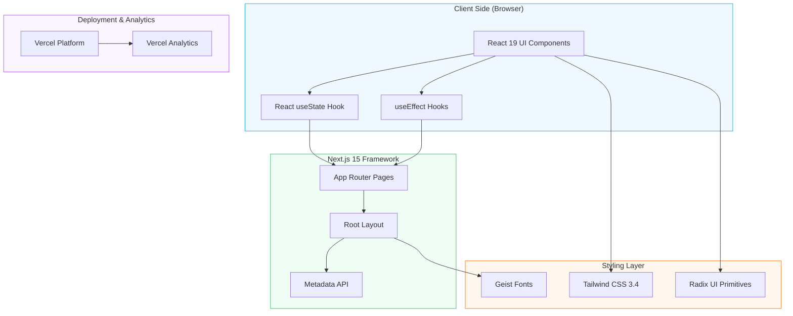

# Coming Soon

> A modern, responsive "Coming Soon" landing page built with Next.js 15 and React 19.

[](https://vercel.com/gileb64375-5584s-projects/v0-coming-soon)
[](https://nextjs.org/)
[](https://www.typescriptlang.org/)
[](https://tailwindcss.com/)

---

## 🚀 System Architecture



---

## 🎯 Key Features

- **Countdown Timer** — Real-time countdown to launch date (30 days from now)
- **Email Subscription** — Collect visitor emails with validation
- **Responsive Design** — Fully optimized for all screen sizes
- **Dark Mode Support** — Automatic theme switching via `next-themes`
- **Social Media Links** — Twitter, GitHub, LinkedIn, and email integration
- **Accessible UI** — Semantic HTML with proper ARIA labels
- **Analytics Integration** — Vercel Analytics for visitor tracking

---

## 🛠️ Development Stack

| Category | Technology |
|----------|------------|
| **Framework** | Next.js 15.2.4 |
| **Runtime** | React 19.2.5 |
| **Language** | TypeScript 5.x |
| **Styling** | Tailwind CSS 3.4.17 |
| **UI Components** | Radix UI (15+ components) |
| **Form Handling** | React Hook Form + Zod |
| **Fonts** | Geist Sans & Mono |
| **Icons** | Lucide React |
| **Deployment** | Vercel |

### UI Component Library
- `@radix-ui/react-*` — Dialog, Dropdown, Select, Toast, Tooltip, Accordion, etc.
- `tailwindcss-animate` — Animation utilities
- `clsx` & `tailwind-merge` — Class name utilities
- `class-variance-authority` — Component variants

---

## 📊 Project Statistics

```json
{
  "totalDependencies": 240,
  "productionPackages": 63,
  "devDependencies": 7,
  "framework": "Next.js 15.2.4",
  "reactVersion": "19.x"
}
```

---

## ⚙️ Configuration Files

### `next.config.mjs`
```javascript
{
  eslint: { ignoreDuringBuilds: true },
  typescript: { ignoreBuildErrors: true },
  images: { unoptimized: true }
}
```

### `tailwind.config.js`
- Dark mode enabled via `class`
- Custom color palette (border, input, primary, secondary, etc.)
- Container centering with responsive breakpoints
- CSS variables for theming
- Animations for accordion components
- Plugin: `tailwindcss-animate`

### `tsconfig.json`
- Strict TypeScript configuration
- Path aliases configured for `@/*` imports

---

## 📋 Available Scripts

| Command | Description |
|---------|-------------|
| `npm run dev` | Start development server |
| `npm run build` | Build for production |
| `npm run start` | Start production server |
| `npm run lint` | Run ESLint |

---

## 🚦 Getting Started

### Prerequisites

- **Node.js** 18.x or later
- **npm** 9.x or later (or pnpm/yarn)

### Installation

```bash
# Clone the repository
git clone https://github.com/your-repo/coming-soon.git

# Navigate to project directory
cd coming-soon

# Install dependencies
npm install --legacy-peer-deps

# Start development server
npm run dev
```

The app will be available at `http://localhost:3000`

### Build for Production

```bash
npm run build
npm run start
```

---

## 🔧 Environment Variables

No environment variables are required for the current setup. However, you may add:

```env
# Optional: Analytics (already included via @vercel/analytics)
NEXT_PUBLIC_VERCEL_ANALYTICS_ID=your-analytics-id
```

---

## 📁 Project Structure

```
coming-soon/
├── app/                    # Next.js App Router
│   ├── layout.tsx         # Root layout with fonts & analytics
│   ├── page.tsx          # Main page entry
│   └── globals.css       # Global styles
├── components/
│   ├── ui/               # Radix UI based components
│   │   ├── button.tsx
│   │   ├── input.tsx
│   │   └── card.tsx
│   └── theme-provider.tsx
├── lib/
│   └── utils.ts          # Utility functions (cn merger)
├── public/               # Static assets
│   └── placeholder.*     # Placeholder images
├── coming-soon.tsx       # Main Coming Soon component
├── package.json          # Dependencies & scripts
├── tailwind.config.js    # Tailwind configuration
├── postcss.config.mjs    # PostCSS configuration
├── next.config.mjs       # Next.js configuration
└── tsconfig.json         # TypeScript configuration
```

---

## 🧩 Component Overview

### ComingSoonPage (`coming-soon.tsx`)
The main component featuring:
- Hero section with headline and description
- Countdown timer (days, hours, minutes, seconds)
- Email subscription form with validation
- Social media links (Twitter, GitHub, LinkedIn, Email)
- Responsive grid layout

### UI Components
- **Button** — Shadcn/ui styled button with variants
- **Input** — Styled form input with focus states
- **Card** — Container component for countdown timer

---

## 🎨 Design System

### Colors (CSS Variables)
```css
--background: hsl(var(--background))
--foreground: hsl(var(--foreground))
--primary: hsl(var(--primary))
--secondary: hsl(var(--secondary))
--muted: hsl(var(--muted))
--accent: hsl(var(--accent))
--destructive: hsl(var(--destructive))
--border: hsl(var(--border))
--input: hsl(var(--input))
--ring: hsl(var(--ring))
```

### Typography
- **Headings:** Geist Sans (variable font)
- **Body:** Geist Sans
- **Code:** Geist Mono

---

## 🔐 Security Notes

- ESLint and TypeScript checks are disabled during build for faster deployment
- Images are unoptimized (suitable for static pages)
- No sensitive data exposure

---

## 📈 Performance

- **Vercel Analytics** enabled for visitor tracking
- **Geist Fonts** self-hosted via Next.js font optimization
- **Lazy-loaded** React components
- **CSS-only animations** (no JS animation libraries)

---

## 🔄 Deployment

The project is automatically deployed to Vercel. Any changes pushed to the main branch will trigger a new deployment.

### Manual Deployment

```bash
# Install Vercel CLI
npm i -g vercel

# Deploy
vercel
```

---

## 🤝 Contributing

1. Fork the repository
2. Create a feature branch (`git checkout -b feature/amazing`)
3. Commit your changes (`git commit -m 'Add amazing feature'`)
4. Push to the branch (`git push origin feature/amazing`)
5. Open a Pull Request

---

## 📄 License

This project is private and for demonstration purposes. Built with [v0.app](https://v0.app).

---

## 🔗 Links

- **Live Demo:** [https://vercel.com/gileb64375-5584s-projects/v0-coming-soon](https://vercel.com/gileb64375-5584s-projects/v0-coming-soon)
- **v0 Project:** [https://v0.app/chat/projects/eQMxRSw9iBR](https://v0.app/chat/projects/eQMxRSw9iBR)
- **Next.js Docs:** [https://nextjs.org/docs](https://nextjs.org/docs)
- **Tailwind CSS:** [https://tailwindcss.com/docs](https://tailwindcss.com/docs)