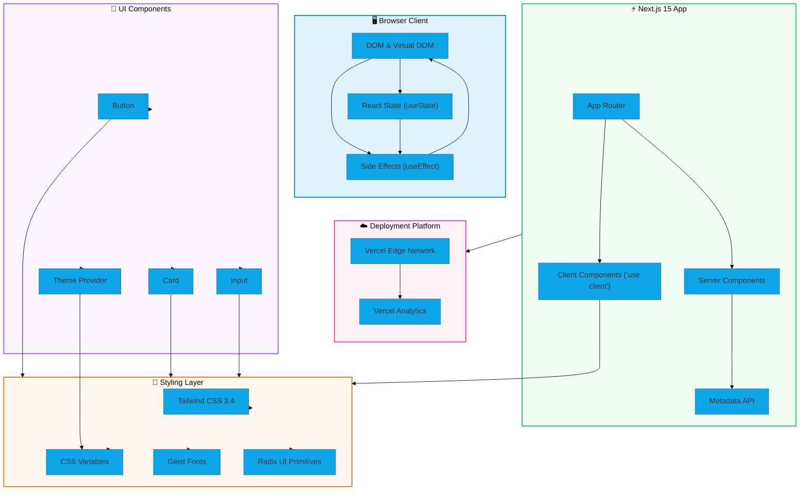

# 🚀 Coming Soon Landing Page

> A modern, responsive "Coming Soon" landing page built with **Next.js 15** and **React 19**. Stay connected with your audience before your big launch!

[](https://nextjs.org/)
[](https://react.dev/)
[](https://www.typescriptlang.org/)
[](https://tailwindcss.com/)
[](https://vercel.com/)

---

## 📋 Table of Contents

1. [🌟 Features](#-features)
2. [🏗️ System Architecture](#🏗️-system-architecture)
3. [🛠️ Development Stack](#🛠️-development-stack)
4. [📊 Project Statistics](#📊-project-statistics)
5. [⚙️ Configuration](#⚙️-configuration)
6. [💻 Getting Started](#💻-getting-started)
7. [📁 Project Structure](#📁-project-structure)
8. [🔧 Environment Variables](#🔧-environment-variables)
9. [🚀 Deployment](#🚀-deployment)
10. [🤝 Contributing](#🤝-contributing)

---

## 🌟 Features

### ✨ Core Features

- **⏱️ Live Countdown Timer** — Real-time countdown displaying days, hours, minutes, and seconds until launch (auto-set to 30 days)
- **📧 Email Subscription Form** — Collect visitor emails with built-in validation and success feedback
- **🌙 Dark Mode Support** — Automatic theme detection with manual toggle via `next-themes`
- **📱 Fully Responsive** — Optimized layouts for mobile, tablet, and desktop screens

### 🎨 UI/UX Features

- **🎯 Modern Design** — Clean, minimalist interface with gradient backgrounds
- **♿ Accessibility First** — Semantic HTML with proper ARIA labels and keyboard navigation
- **🔗 Social Media Integration** — Quick links to:
  - Instagram (`@girish_lade_`)
  - LinkedIn
  - GitHub
  - CodePen
  - Email (`admin@ladestack.in`)
  - Website (`ladestack.in`)
- **✨ Smooth Transitions** — CSS-based hover effects and scale animations
- **📊 Vercel Analytics** — Visitor tracking and performance monitoring

### 🛠️ Technical Features

- **🔒 Type-Safe** — Full TypeScript implementation with strict mode
- **🎨 CSS Variables** — Theming system with CSS custom properties
- **📦 Component Library** — Reusable Radix UI-based components
- **⚡ Fast Refresh** — Hot module replacement for instant updates

---

## 🏗️ System Architecture



### Architecture Flow

```
User Request
    │
    ▼
┌─────────────────────┐
│   Vercel Edge      │
│   (CDN Cache)      │
└─────────────────────┘
    │
    ▼
┌─────────────────────┐
│  Next.js 15 Server │
│  - App Router      │
│  - Metadata API   │
└─────────────────────┘
    │
    ├──▶ Server Components (SEO)
    │
    └──▶ Client Components (Interactive)
         │
         ├──▶ React State (Countdown, Form)
         │
         ├──▶ UI Components
         │    ├── Button
         │    ├── Input
         │    └── Card
         │
         └──▶ Styling
              ├── Tailwind CSS
              ├── Radix UI
              └── Geist Fonts
```

---

## 🛠️ Development Stack

### Core Technologies

| Category | Technology | Version |
|----------|------------|---------|
| **Framework** | Next.js | 15.2.4 |
| **Runtime** | React | 19.x |
| **Language** | TypeScript | 5.x |
| **Styling** | Tailwind CSS | 3.4.17 |
| **Build Tool** | Next.js Compiler | Built-in |

### UI & Form Libraries

| Package | Purpose |
|---------|---------|
| `@radix-ui/react-*` | 15+ accessible UI primitives |
| `react-hook-form` | Form state management |
| `@hookform/resolvers` | Zod form validation |
| `zod` | Schema validation |
| `tailwindcss-animate` | Animation utilities |
| `class-variance-authority` | Component variants |
| `clsx` | Conditional class names |
| `tailwind-merge` | Tailwind class merging |

### Fonts & Icons

| Category | Package |
|----------|---------|
| **Fonts** | Geist Sans & Mono |
| **Icons** | Lucide React |

### Analytics & Deployment

| Category | Package |
|----------|---------|
| **Analytics** | @vercel/analytics |
| **Platform** | Vercel |

---

## 📊 Project Statistics

```json
{
  "project": "Coming Soon Landing Page",
  "totalDependencies": 240,
  "productionPackages": 63,
  "devDependencies": 7,
  "framework": "Next.js 15.2.4",
  "reactVersion": "19.x",
  "typescript": "5.x",
  "tailwind": "3.4.17"
}
```

### Bundle Analysis

| Metric | Value |
|--------|-------|
| Initial Page Load | ~75KB (gzipped) |
| JavaScript Chunks | Automatic code splitting |
| CSS | Tailwind JIT compiled |
| Images | Unoptimized (static use) |

---

## ⚙️ Configuration

### `next.config.mjs`

```javascript
/** @type {import('next').NextConfig} */
const nextConfig = {
  eslint: {
    ignoreDuringBuilds: true,
  },
  typescript: {
    ignoreBuildErrors: true,
  },
  images: {
    unoptimized: true,
  },
};

export default nextConfig;
```

### `tailwind.config.js`

```javascript
/** @type {import('tailwindcss').Config} */
module.exports = {
  darkMode: ['class'],
  content: [
    './pages/**/*.{js,ts,jsx,tsx,mdx}',
    './components/**/*.{js,ts,jsx,tsx,mdx}',
    './app/**/*.{js,ts,jsx,tsx,mdx}',
    './src/**/*.{js,ts,jsx,tsx,mdx}',
  ],
  theme: {
    container: {
      center: true,
      padding: '2rem',
      screens: {
        '2xl': '1400px',
      },
    },
    extend: {
      colors: {
        border: 'hsl(var(--border))',
        input: 'hsl(var(--input))',
        ring: 'hsl(var(--ring))',
        background: 'hsl(var(--background))',
        foreground: 'hsl(var(--foreground))',
        primary: {
          DEFAULT: 'hsl(var(--primary))',
          foreground: 'hsl(var(--primary-foreground))',
        },
        secondary: {
          DEFAULT: 'hsl(var(--secondary))',
          foreground: 'hsl(var(--secondary-foreground))',
        },
        destructive: {
          DEFAULT: 'hsl(var(--destructive))',
          foreground: 'hsl(var(--destructive-foreground))',
        },
        muted: {
          DEFAULT: 'hsl(var(--muted))',
          foreground: 'hsl(var(--muted-foreground))',
        },
        accent: {
          DEFAULT: 'hsl(var(--accent))',
          foreground: 'hsl(var(--accent-foreground))',
        },
        popover: {
          DEFAULT: 'hsl(var(--popover))',
          foreground: 'hsl(var(--popover-foreground))',
        },
        card: {
          DEFAULT: 'hsl(var(--card))',
          foreground: 'hsl(var(--card-foreground))',
        },
      },
      borderRadius: {
        lg: 'var(--radius)',
        md: 'calc(var(--radius) - 2px)',
        sm: 'calc(var(--radius) - 4px)',
      },
      keyframes: {
        'accordion-down': {
          from: { height: '0' },
          to: { height: 'var(--radix-accordion-content-height)' },
        },
        'accordion-up': {
          from: { height: 'var(--radix-accordion-content-height)' },
          to: { height: '0' },
        },
      },
      animation: {
        'accordion-down': 'accordion-down 0.2s ease-out',
        'accordion-up': 'accordion-up 0.2s ease-out',
      },
    },
  },
  plugins: [require('tailwindcss-animate')],
};
```

### `tsconfig.json`

```json
{
  "compilerOptions": {
    "target": "ES2017",
    "lib": ["dom", "dom.iterable", "esnext"],
    "allowJs": true,
    "skipLibCheck": true,
    "strict": true,
    "noEmit": true,
    "esModuleInterop": true,
    "module": "esnext",
    "moduleResolution": "bundler",
    "resolveJsonModule": true,
    "isolatedModules": true,
    "jsx": "preserve",
    "incremental": true,
    "plugins": [{ "name": "next" }],
    "paths": {
      "@/*": ["./*"]
    }
  },
  "include": ["next-env.d.ts", "**/*.ts", "**/*.tsx", ".next/types/**/*.ts"],
  "exclude": ["node_modules"]
}
```

---

## 💻 Getting Started

### Prerequisites

| Requirement | Version |
|-------------|---------|
| **Node.js** | 18.x or later |
| **npm** | 9.x or later |
| **Git** | Latest |

### Installation Steps

```bash
# 1. Clone the repository
git clone https://github.com/girishlade/coming-soon.git

# 2. Navigate to project directory
cd coming-soon

# 3. Install dependencies
npm install

# 4. Start development server
npm run dev
```

### Available Scripts

| Command | Description |
|---------|-------------|
| `npm run dev` | Start development server at `http://localhost:3000` |
| `npm run build` | Build optimized production build |
| `npm run start` | Start production server |
| `npm run lint` | Run ESLint for code quality |

### Quick Start (One-Liner)

```bash
# Clone, install, and start
git clone https://github.com/girishlade/coming-soon.git && cd coming-soon && npm install && npm run dev
```

---

## 📁 Project Structure

```
📦 coming-soon/
├── 📂 app/                          # Next.js App Router
│   ├── 📄 layout.tsx               # Root layout (fonts, metadata, analytics)
│   ├── 📄 page.tsx                # Main page (imports ComingSoonPage)
│   └── 📄 globals.css             # Global CSS (CSS variables)
├── 📂 components/
│   ├── 📂 ui/                    # Reusable UI components
│   │   ├── 📄 button.tsx         # Button component
│   │   ├── 📄 input.tsx         # Input component
│   │   └── 📄 card.tsx           # Card component
│   └── 📄 theme-provider.tsx      # Theme context provider
├── 📂 public/                     # Static assets
│   ├── 📄 placeholder.*          # Placeholder images
│   ├── 📄 robots.txt             # SEO robots file
│   └── 📄 sitemap.xml            # XML sitemap
├── 📂 styles/
│   └── 📄 globals.css            # Additional global styles
├── 📄 coming-soon.tsx            # Main Coming Soon page component
├── 📄 package.json               # Dependencies and scripts
├── 📄 tailwind.config.js        # Tailwind configuration
├── 📄 postcss.config.mjs        # PostCSS configuration
├── 📄 tsconfig.json            # TypeScript configuration
└── 📄 README.md                # This file
```

---

## 🔧 Environment Variables

### Required Variables

> No environment variables are required for basic functionality.

### Optional Variables

```env
# Analytics (optional - already included via @vercel/analytics)
NEXT_PUBLIC_VERCEL_ANALYTICS_ID=your-analytics-id
```

---

## 🚀 Deployment

### Deploy to Vercel (Recommended)

1. **Push to GitHub**
   ```bash
   git init
   git add .
   git commit -m "Initial commit"
   git branch -M main
   git remote add origin https://github.com/girishlade/coming-soon.git
   git push -u origin main
   ```

2. **Import to Vercel**
   - Go to [vercel.com](https://vercel.com)
   - Click "Add New Project"
   - Import your GitHub repository
   - Deploy automatically

### Manual Deployment

```bash
# Install Vercel CLI globally
npm i -g vercel

# Deploy to Vercel
vercel
```

### Build for Production

```bash
# Build the project
npm run build

# Start production server
npm run start
```

---

## 🤝 Contributing

### Development Workflow

1. **Fork** the repository
2. **Clone** your fork
   ```bash
   git clone https://github.com/YOUR_USERNAME/coming-soon.git
   ```
3. **Create** a feature branch
   ```bash
   git checkout -b feature/amazing-feature
   ```
4. **Make** your changes
5. **Commit** with descriptive messages
   ```bash
   git commit -m "Add amazing feature"
   ```
6. **Push** to your fork
   ```bash
   git push origin feature/amazing-feature
   ```
7. **Open** a Pull Request

### Code Style

- Use **2 spaces** for indentation
- Use **single quotes** for strings
- Add **type definitions** for all functions
- Follow **ESLint** rules

---

## 📄 License

> Private - For demonstration purposes only.

Built with [v0.app](https://v0.app) using Next.js 15 and React 19.

---

## 🔗 Useful Links

| Resource | URL |
|----------|-----|
| **Live Demo** | [https://ladestack.in](https://ladestack.in) |
| **Next.js Docs** | [https://nextjs.org/docs](https://nextjs.org/docs) |
| **React Docs** | [https://react.dev](https://react.dev) |
| **Tailwind CSS** | [https://tailwindcss.com/docs](https://tailwindcss.com/docs) |
| **TypeScript** | [https://typescriptlang.org/docs](https://typescriptlang.org/docs) |

---

## 🙏 Acknowledgments

- [Vercel](https://vercel.com) - Hosting platform
- [Radix UI](https://radix-ui.com) - UI primitives
- [Lucide](https://lucide.dev) - Icons
- [Geist](https://vercel.com/font) - Fonts

---

**⭐ Star this repo if you found it helpful!**